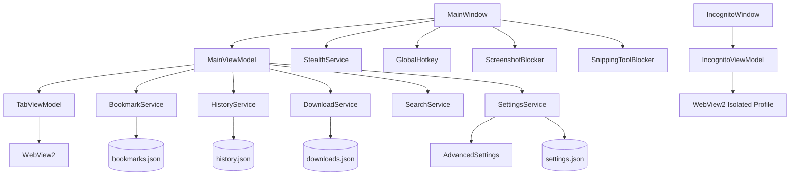

# 🏗️ Архитектура проекта KingBrowser (GhostBrowser)

## Обзор системы

**Название проекта:** KingBrowser (GhostBrowser)  
**Версия:** 1.0.0  
**Дата создания:** 2026  
**Назначение:** Браузер с фокусом на приватность и stealth-режимом, скрывающий окно от программ захвата экрана (OBS, Discord, Zoom и др.)

## Стек технологий
| Категория | Технология | Версия | Обоснование |
|-----------|------------|--------|-------------|
| Язык | C# | 12 | Современный типобезопасный язык с async/await |
| Фреймворк | .NET WPF | 7.0 | Нативный UI для Windows, кастомная стилизация |
| Рендеринг | Microsoft WebView2 | 1.0.2739.15 | Chromium-движок через официальную интеграцию |
| Паттерн | MVVM | - | Разделение View/ViewModel/Model |
| API | Win32 API | - | SetWindowDisplayAffinity, RegisterHotKey |

## Структура проекта
```
KingBrowser/
├── Models/                 # Модели данных
│   ├── Bookmark.cs
│   ├── HistoryEntry.cs
│   ├── DownloadItem.cs
│   ├── DownloadItemStatus.cs
│   ├── AdvancedSettings.cs
│   ├── UserProfile.cs
│   ├── AdBlockFilter.cs
│   ├── AutoFillProfile.cs
│   └── SyncResult.cs
├── Services/               # Бизнес-логика и системные сервисы
│   ├── StealthService.cs       # Скрытие окна от захвата экрана
│   ├── GlobalHotkey.cs         # Перехват PrintScreen и F12
│   ├── ScreenshotBlocker.cs    # Блокировка скриншотов через JS
│   ├── SnippingToolBlocker.cs  # Блокировка WM_PRINT/WM_PRINTCLIENT
│   ├── SearchService.cs        # Мульти-поиск (Google, Bing, DDG, Yandex)
│   ├── BookmarkService.cs      # Сохранение/загрузка закладок
│   ├── HistoryService.cs       # История просмотров (макс 1000)
│   ├── SettingsService.cs      # Настройки + DNS тестирование
│   ├── DownloadService.cs      # Менеджер загрузок с паузой
│   ├── ProxyService.cs         # Обход блокировок (DoH, SOCKS5/HTTP)
│   ├── GoodbyeDPIService.cs    # Интеграция локального обхода DPI (ТСПУ)
│   ├── XrayService.cs          # Интеграция VPN (vless/vmess)
│   ├── AdBlockService.cs       # Блокировка рекламы
│   ├── AutoFillService.cs      # Автозаполнение форм
│   └── ProfileService.cs       # Мульти-профильность
├── ViewModels/             # MVVM ViewModel
│   ├── ViewModelBase.cs        # INotifyPropertyChanged
│   ├── RelayCommand.cs         # ICommand реализация
│   ├── AsyncRelayCommand.cs    # Async ICommand
│   ├── MainViewModel.cs        # Логика главного окна
│   ├── IncognitoViewModel.cs   # Логика инкогнито
│   └── TabViewModel.cs         # Управление вкладкой
├── Views/                  # Вторичные окна
│   ├── SettingsPage.xaml/.cs   # Страница настроек
│   └── DnsTestWindow.xaml/.cs  # Тест DNS
├── App.xaml / App.xaml.cs      # Вход + глобальные стили
├── MainWindow.xaml/.cs         # Главное окно браузера
├── IncognitoWindow.xaml/.cs    # Окно инкогнито
├── NewTabPage.html             # Новая вкладка
├── KING11.png                  # Логотип
└── GhostBrowser.csproj         # Конфигурация проекта
```

## Архитектурная диаграмма


## Компоненты системы

### 1. Главное окно (MainWindow + MainWindowViewModel)
**Ответственность:** Отображение UI, управление вкладками, навигация, закладки, история  
**Входные данные:** Действия пользователя (клики, горячие клавиши)  
**Выходные данные:** WebView2 рендеринг, обновления UI  
**Зависимости:** TabViewModel, BookmarkService, HistoryService, SearchService, StealthService

### 2. Stealth Mode (StealthService + ScreenshotBlocker + SnippingToolBlocker)
**Ответственность:** Скрытие окна от программ захвата, блокировка скриншотов  
**Входные данные:** События окна, сообщения Windows  
**Выходные данные:** Изменение display affinity, инъекция JS  
**Зависимости:** Win32 API (SetWindowDisplayAffinity, WM_PRINTCLIENT)

### 3. Горячие клавиши (GlobalHotkey)
**Ответственность:** Перехват PrintScreen, F12 (паника), системные комбинации  
**Входные данные:** Системные сообщения клавиатуры  
**Выходные данные:** Блокировка скриншотов, паник-режим  
**Зависимости:** RegisterHotKey/UnregisterHotKey Win32 API

### 4. Инкогнито режим (IncognitoWindow + IncognitoViewModel)
**Ответственность:** Изолированный просмотр без сохранения данных  
**Входные данные:** Действия пользователя в инкогнито  
**Выходные данные:** WebView2 с изолированным профилем  
**Зависимости:** WebView2 UserDataFolder, файловая система (удаление при закрытии)

### 5. Настройки (SettingsService + SettingsPage)
**Ответственность:** Управление настройками, DNS, тема, прокси  
**Входные данные:** Изменения пользователя  
**Выходные данные:** settings.json, применение настроек  
**Зависимости:** AdvancedSettings модель, DNS тестирование (HTTP + UDP)

## Паттерны проектирования
- **MVVM** — разделение View/ViewModel/Model
- **Command Pattern** — RelayCommand и AsyncRelayCommand для ICommand
- **Dependency Injection (ручная)** — сервисы инстанцируются в ViewModel
- **Observer (INotifyPropertyChanged)** — реактивные обновления UI
- **Singleton** — SettingsService для доступа к настройкам
- **Repository** — BookmarkService, HistoryService для работы с JSON-хранилищем
- **Strategy** — SearchService с разными поисковыми движками

## Принципы взаимодействия
1. Каждая вкладка инкапсулирована в TabViewModel
2. Сервисы независимы и общаются через четкие интерфейсы
3. Все данные сохраняются в JSON (%APPDATA%\GhostBrowser\)
4. Асинхронные операции через async/await
5. WebView2 ресурсы освобождаются через Dispose

## Ключевые API и механизмы
| Компонент | API | Назначение |
|-----------|-----|------------|
| StealthService | SetWindowDisplayAffinity (WDA_EXCLUDEFROMCAPTURE) | Скрытие от OBS/Discord/Zoom |
| GlobalHotkey | RegisterHotKey Win32 | Перехват PrintScreen, F12 |
| ScreenshotBlocker | WebView2 ExecuteScriptAsync | Блокировка Canvas/WebGL/AudioContext |
| SnippingToolBlocker |WndProc, WM_PRINTCLIENT | Блокировка ножниц/скриншотов |
| DownloadService | HTTP Range Header | Пауза/возобновление загрузок |
| SettingsService | HTTP + UDP DNS запросы | Тестирование DNS серверов |

## Решения и обоснования
| Решение | Альтернативы | Почему выбрано |
|---------|--------------|----------------|
| WebView2 вместо CEF | CEFSharp, ChromiumFX | Официальная поддержка Microsoft, меньше размер |
| JSON для хранения данных | SQLite, XML | Простота, читаемость, нет зависимостей |
| WPF вместо WinForms | WinForms, Avalonia | Лучшая кастомизация UI, современный рендеринг |
| .NET 7 | .NET 8, .NET Framework 4.8 | Баланс стабильности и возможностей |
| Ручной DI вместо контейнера | Microsoft.Extensions.DependencyInjection | Простота проекта, нет оверхеда |
| Proxy через --proxy-server | Системный DNS, VPN | Не требует админ прав, только для браузера |
